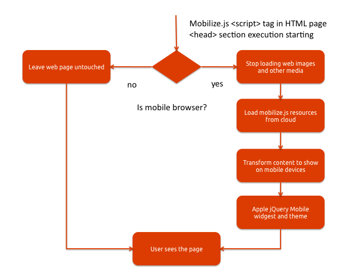

=============================
 Introduction
=============================

.. contents :: :local:

About
-----

Mobilize.js transforms websites
to mobile sites with Javascript: 
it is easy to integrate with any system,
looks good and uses technologies familiar for
web developers. 

The revolutionary idea behind Mobilize.js is that
it pushes difficult content presentation choices to a web browser
instead trying to figure them out on a server.
This is embracing of the original philosophy of HTML mark-up language:
the browser knows best how the page should look like.
With Mobilize.js we serve a normal web page 
and let an embedded Javascript file  
decide should the page be mobilized.

Mobilize.js will do the same for internet mobilization 
what Google Maps did for map services.

Benefits
--------------------------------------------

Modern mobile devices
are smart enough to decide what is the best way to display
the content for their users.

The client orientation and lack of complex server-side dependencies
makes Mobilize.js simple and easy to integrate to **any** web system.
You need only to add one <script> tag; it works even on static HTML files.
You deploy it easily and tap the potential of quickly growing mobile internet.
Mobilize.js won't stop you updating your server.

Mobilize.js is written in Javascript and jQuery - both
which are ubiquitous technologies for HTML5 developers. 
Mobilize.js is the most developer friendly 
mobilization solution out there. You learn it easily, 
getting more done in less time.

How it works
--------------

mobilize.js <script> tags are inserted on your HTML source code
like with any other Javascript library. Then you give what web 
site elements belong to mobile site.

.. image:: images/screenshots/transform.png

When the web page loads, mobilize.js checks whether the browser
is a mobile browser or a normal desktop browser. For mobile
browsers, a special transformation step takes place.

* All unneeded web resources (text, images, CSS, Javascript) is left unloaded

* Content is reformated for mobile display

* jQuery Mobile theme is applied on the page

Architecture
-------------

mobilize.js builds on the top HTML5 and popular jQuery and jQuery Mobile Javascript frameworks.
In the diagram below the relationship between mobilize.js and the frameworks is explained.

.. image:: images/mobilizejs/Slide1.png

Easy to integrate
--------------------

.. image:: images/mobilizejs/Slide3.png

Because mobilize.js does not have difficult server-side components, 
it is very easy to integrate to different systems. Currently
out of the box supported systems are :doc:`Wordpress blogging platform </integrations/wordpress>`,
:doc:`Sphinx documentation system </integrations/sphinx>` and the list is growing fast.

For example, Wordpress integration plug-in is effectively only ~150 lines of code.
Code examples are available for PHP, Apache and other popular platforms.

Cloud hosted
--------------

mobilize.js comes withs own content delivery network (CDN) solution.
You do not need trouble your server with complex files. CDN automatically
optimizes all Javascript and CSS files for the fastest possible download
rates.

With CDN hosting and ever evolving mobile landscape, your data
for the mobile devices is always up-to-date.

It is also possible to host files yourself for intranet solutions.

Open source
------------

mobilize.js is an open source solution. It is hosted on `Github <https://github.com/mobilizejs/mobilize.js>`
which is a popular social coding source code repository. 

Open source nature guarantees
long term feasibility and high quality of the project. Not only that
you can customize mobilize.js for your own needs, but there is 
community process in place for `support <http://groups.google.com/group/mobilizejs-users>`, 
issue tracking <https://github.com/miohtama/mobilize.js/issues>`_ and
development `<http://groups.google.com/group/mobilizejs-users>`_. 

Device support
--------------- 

mobilize.js supports :doc:`jQuery Mobile grade A devices </support>`.
The supports covers most of developed country mobile internet devices. 

It is possible to further tune mobilize.js to increase
the device support for low end devices.
 